Física
======

**E01 ------------------------------------------**

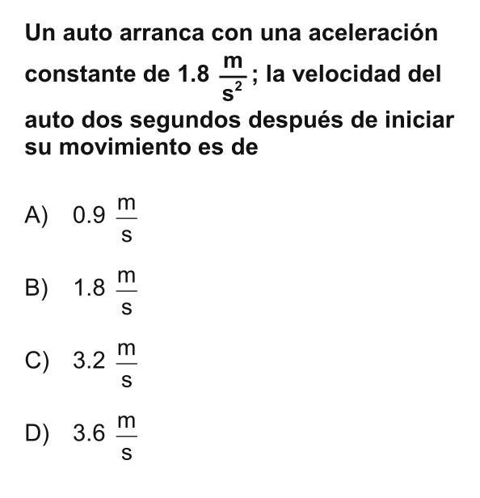

**E02 ------------------------------------------**

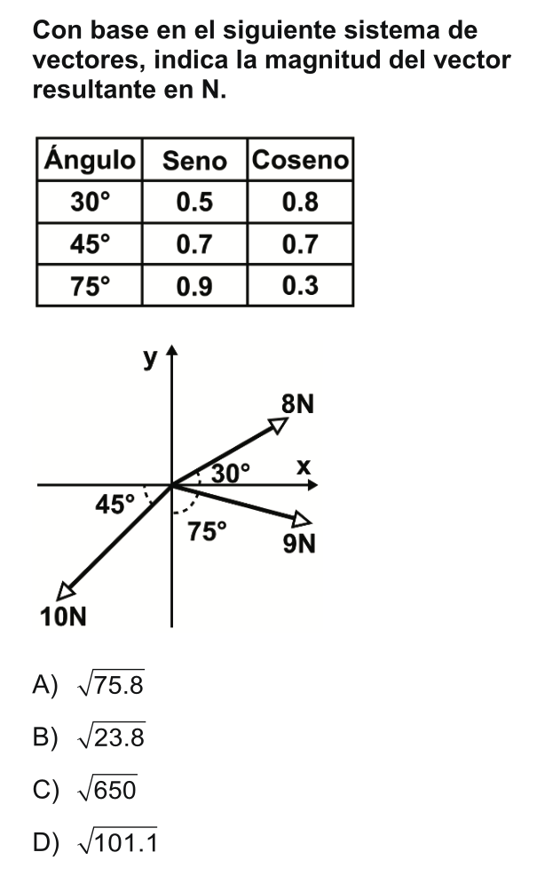
   
**E03 ------------------------------------------**

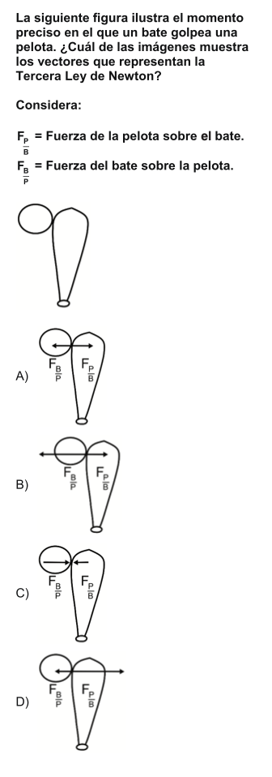
   
**E04 ------------------------------------------**

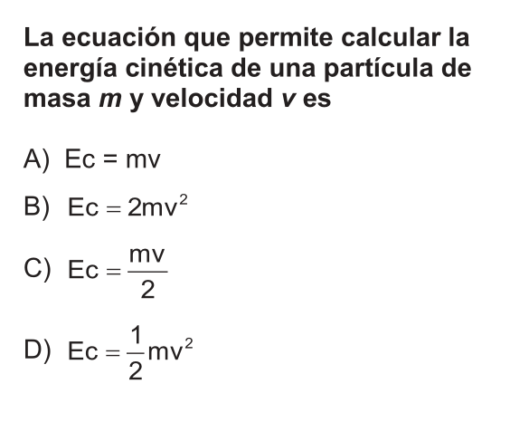
   
**E05 ------------------------------------------**

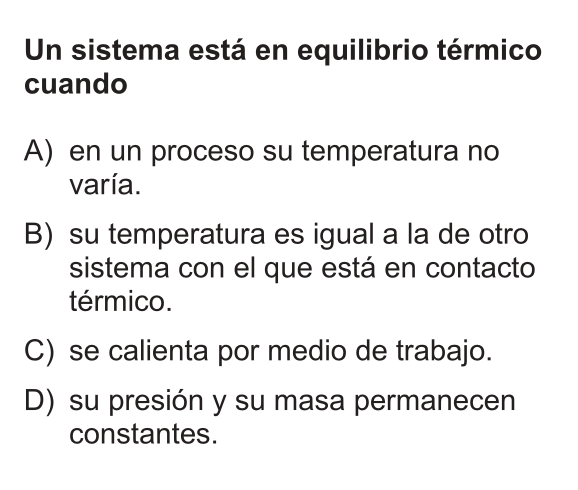
   
**E06 ------------------------------------------**

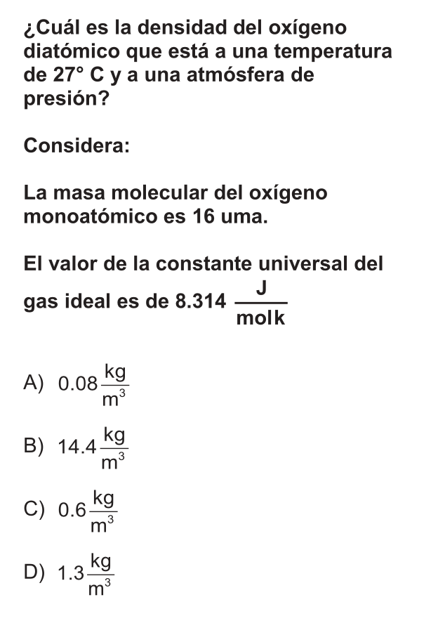
   
**E07 ------------------------------------------**

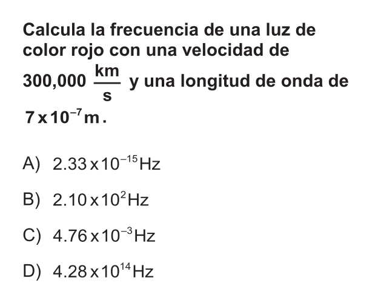
   
**E08 ------------------------------------------**

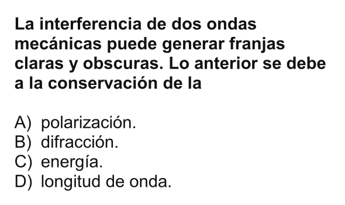
   
**E09 ------------------------------------------**

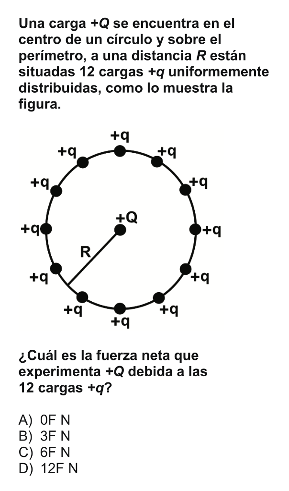
   
**E10 ------------------------------------------**

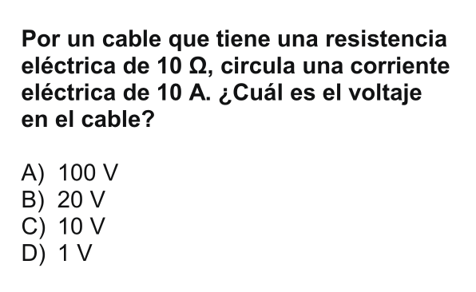
   
**E11 ------------------------------------------**

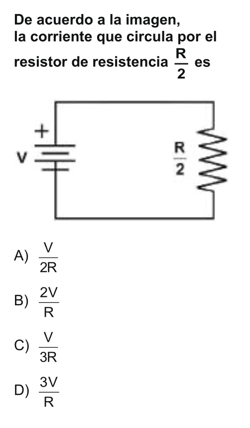

**E12 ------------------------------------------**

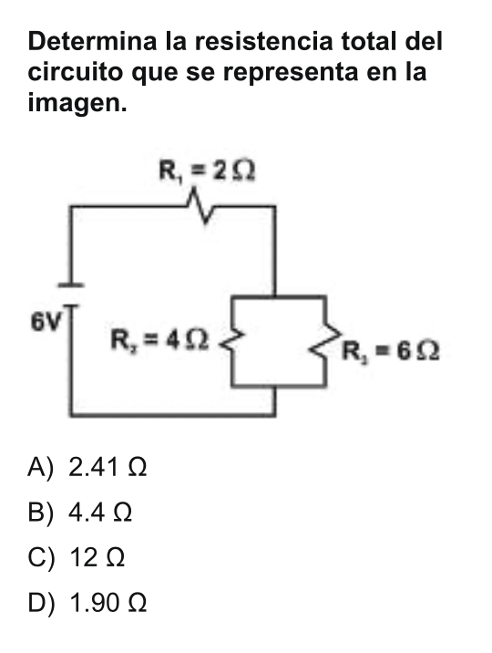

**E13 ------------------------------------------**

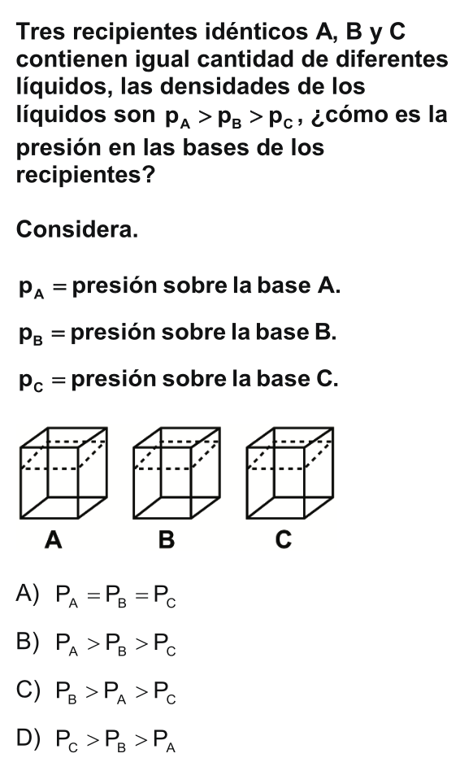

**E14 ------------------------------------------**

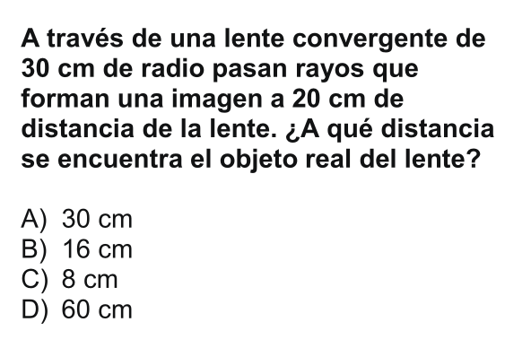

**E15 ------------------------------------------**

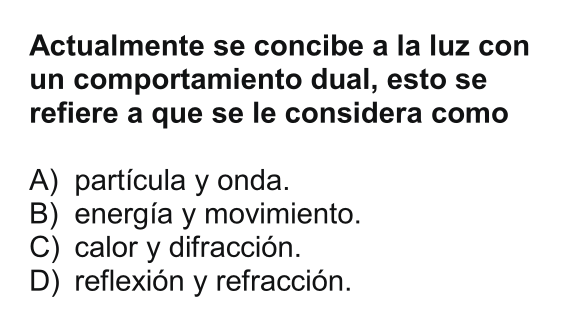

**E16 ------------------------------------------**

