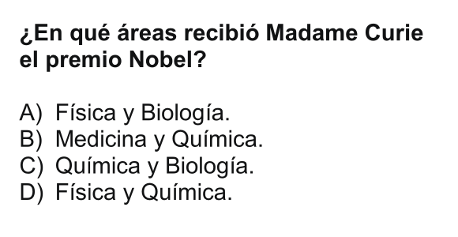

Física
======

**E01 ------------------------------------------**

**E02 ------------------------------------------**

.. image:: fis02.png
   :scale: 60 % 
   
**E03 ------------------------------------------**

   
**E04 ------------------------------------------**

   
**E05 ------------------------------------------**

.. image:: fis05.png
   :scale: 60 % 
   
**E06 ------------------------------------------**

.. image:: fis06.png
   :scale: 60 % 
   
**E07 ------------------------------------------**

.. image:: fis07.png
   :scale: 60 % 
   
**E08 ------------------------------------------**

.. image:: fis08.png
   :scale: 60 % 
   
**E09 ------------------------------------------**

   
**E10 ------------------------------------------**

   
**E11 ------------------------------------------**

**E12 ------------------------------------------**

**E13 ------------------------------------------**

**E14 ------------------------------------------**

**E15 ------------------------------------------**

**E16 ------------------------------------------**

